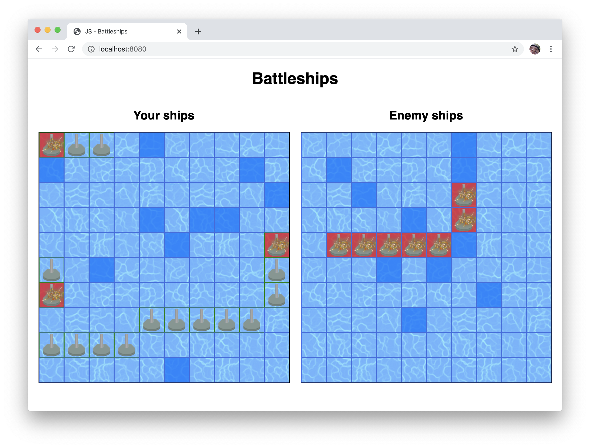
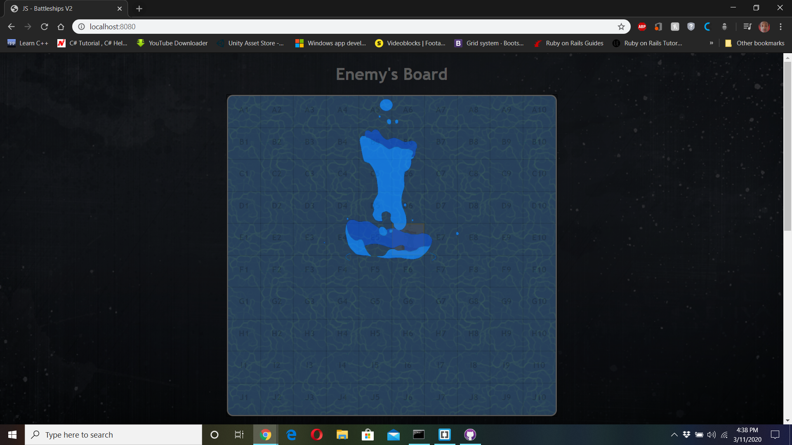
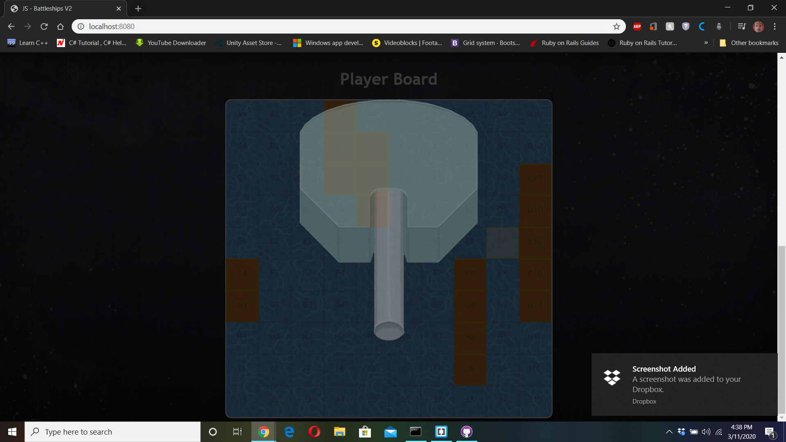

# JS-BattleShips
Creating the classic game ‘Battleship’ within a Test Development Driven (TDD) environment. If you’ve never played it, or if you need a refresher, you can read about it [here](https://en.wikipedia.org/wiki/Battleship_(game)) and you can play an online version [here](http://en.battleship-game.org/).





## Setup for Local use

### Install Dependencies

```
$ npm install
```

### Run Application

```
$ npm run start
```
Now within your browser of choice, type http://localhost:8080 in the address bar to access the game.

### Running Tests

```
$ npm run test
```

## [Live DEMO](https://raw.githack.com/Aaron-RN/JS-BattleShips-V2/development/dist/index.html)

## Built With

- HTML, CSS
- [JavaScript](https://developer.mozilla.org/en-US/docs/Web/JavaScript)
- [Node Package Manager(NPM)](https://www.npmjs.com/)
- [Jest](https://github.com/facebook/jest)

### Future Tasks

- Switch all setTimeout() related functions to async and await functions

## Authors

👤 **Aaron Rory**

- GitHub: [@Aaron-RN](https://github.com/Aaron-RN)
- Twitter: [@ARNewbold](https://twitter.com/ARNewbold)
- Linkedin: [Aaron Newbold](https://www.linkedin.com/in/aaron-newbold-1b9233187/)

👤 **Eleazar Meza Rivas**

- GitHub: [@elshaka](https://github.com/elshaka)
- Twitter: [@elshaka](https://twitter.com/elshaka)
- Linkedin: [Eleazar Meza Rivas](https://www.linkedin.com/in/elshaka/)

## 🤝 Contributing

Contributions, issues and feature requests are welcome!

Feel free to check the [issues page](issues/).

## Show your support

Give a ⭐️ if you like this project!

## 📝 License

This project is [MIT](lic.url) licensed.
